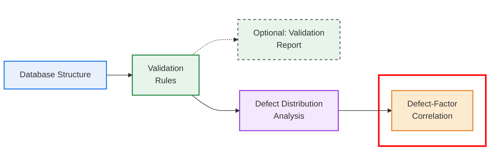

# Interaction between factors and defects in sewer systems

# Project overview

This repository is part of a broader project that aims to analyze sewer deterioration at the defect level. The steps of this project are presented in the figure below. This repository corresponds to the data validation stage, highlighted in red in the figure.


---
## Interaction between factors and defects in sewer systems - Repository
This repository analyzes CCTV inspection data and reported sewer defects to explore the relationships between pipe-related factors—both numerical and categorical—and different defect types. The analysis is conducted separately for each pipe material to identify patterns, similarities, and differences in how factors relate to defects.

The workflow is organized into four main stages:

**1. Data Preparation**
Prepares the data for consistent analysis and comparison. Users can interact with this stage to select subsets of the data, such as pipe material, factors of interest, and other filtering criteria.

**2. Dataset description**
Provides a descriptive analysis of the dataset variables using boxplots, tables, and correlation analysis.

**3. Analysis of the effect of influencing factors on pipe condition**  
Examines the relationships between influencing factors and two pipe condition metrics (condition score and number of defects per pipe), analyzed separately for each pipe material.

**4. Analysis of the effect of influencing factors on defect types**  
Examines the relationships between influencing factors and defect types, analyzed separately for each pipe material.

---
## Code structure
The repository contains the main workflow notebook together with the Python scripts used for data preparation, cleaning, scoring, factor grouping, and statistical/visual analysis. The current project structure is as follows.

- `Interaction_Defects_Factors.ipynb` — main analysis notebook that orchestrates the workflow, loads the data, calls the analysis functions, and generates the figures.
- `Load_Excel.py` — loads data from Excel files and prepares the input tables.
- `Data_Preparation.py` — merges pipe, defect, CCTV, and hydraulic information; validates factors and prepares analysis-ready datasets.
- `Clean_outliers.py` — removes outliers using an isolation forest approach by material.
- `Condition_score_final.py` — computes and assigns pipe condition scores and grades.
- `Group_factors.py` — groups numerical variables into bins for analysis.
- `Config.py` — configuration values such as category colors and display orders.
- `Description_dataset.py` — summary statistics and dataset description plots.
- `Save_figure.py` — utility to save figures as PDF files.
- `Analysis_condition_metrics_numerical.py` — correlations and summary plots for condition metrics vs factors.
- `Analysis_condition_metrics_categorical.py` — categorical analysis of condition metrics.
- `Analysis_defect_type_numerical.py` — defect-type analysis against numerical factors.
- `Analysis_defect_type_categorical.py` — defect-type analysis against categorical factors.
- `Linear_analysis_defect_type.py` — linear analysis for defect types.
- `Linear_analysis_defects_per_pipe.py` — linear analysis of aggregate defect counts per pipe.
---
## Input data
The code is designed to accept an Excel file (.xlsx or .xls) as input, which can be structured in two ways:

### Option 1 — Create your own input file
Manually create an Excel file that contains the following sheets:

1. **PIPES:** Description of the pipes in the network.

2. **CCTV:** Data related to pipe inspections.

3. **DEFECTS:**   Details of observed defects.

4. **HYDRAULIC_PROPERTIES:** *(optional)* Information on the hydraulic characteristics of the pipes, such as flow rate and velocity. 
This sheet should only be included if hydraulic properties are required as part of the analysis.

Detailed descriptions of the required columns for each sheet are provided in **Appendix A**.

### Option 2 — Follow the full framework (recommended)  
  Generate the input dataset by following the complete workflow proposed in this project.  
  Each stage of the framework is implemented in a dedicated repository and can be followed step by step:
  - Implement the database structure  
  - Apply the validation rules to your raw data  
  - Export the validated dataset as an Excel file
  > **Important note:** See the workflow diagram above. Each step is clickable and links to the corresponding code and documentation.

---
## Data Validation (optional)
The following repository provides a tool for validating the data used in this analysis.

https://github.com/SewerDefectAnalysis/Data_validation.git

The use of the data validation repository is not mandatory to run this repository. However, it is a useful tool for validating the input data prior to performing the analysis.

---
## Installation and setup
This project is developed in Python and uses the following core libraries:
- `numpy`: numerical operations and array handling
- `pandas`: data import, cleaning, and table manipulation
- `matplotlib`: plotting and figure generation
- `seaborn`: statistical visualization
- `scipy`: statistical tests and numerical routines
- `statsmodels`: regression and hypothesis-testing utilities
- `scikit-learn`: outlier detection and feature-based analysis
- `openpyxl`: Excel file reading and writing
- `jupyter` or `ipykernel`: to run the notebook interactively

A typical installation is:

```bash
python -m pip install numpy pandas matplotlib seaborn scipy statsmodels scikit-learn openpyxl jupyter
```

If you are working in a notebook environment, also ensure the kernel uses the same Python environment where these packages were installed.

---
## How to run
**1.** Open the notebook `Interaction_Defects_Factors.ipynb`.  

**2.** Configure the input data settings and load the data.
Go to the _Load data from Excel_ section and set the file path and sheet names.  

**3.** Run all cells in the notebook.

---
## Outputs
After running all the cells, the notebook generates visualizations that support the analysis of:  

- Description of the variables in the dataset.  
- Relationships between pipe condition metrics and the selected factors.  
- Relationships between defect types and the selected factors.  

These visualizations provide insights into how the selected factors influence defect occurrence in different pipe materials.

---
## Citation
If you use this repository in your research, please cite the corresponding paper:  

_(Add citation)_

---
## License
This project is distributed under the MIT License.  
See the `LICENSE` file for the full text.

---
## Contact
For questions, feedback, or collaboration inquiries related to the paper or this repository, please contact the corresponding author:

**María A. González**  
Email: _mgon869@aucklanduni.ac.nz_  
Affiliation: University of Auckland

---
## Appendix A
The tables below list the columns required to run the analysis, together with their definitions and units. The input file **must use the exact column names shown below** to ensure that the analysis runs correctly.

### PIPES

| Column             | Description                                            |
| ------------------ |--------------------------------------------------------|
| Pipe_ID            | Unique identifier for each pipe in the network.        |
| Material           | Pipe material (e.g., PVC, PE, AC, CONC, VC).           |
| List of factors         | List of factors to be included in the analysis. Each factor must be in a different column.       |

### CCTV

| Column               | Description                                               |
| -------------------- | --------------------------------------------------------- |
| Inspection_ID        | Unique identifier for each CCTV inspection.               |
| Pipe_ID              | Unique identifier linking the inspection to a pipe.       |
| Survey_length        | Length of the pipe surveyed during the inspection (m).    |

### DEFECTS

| Column                           | Description                                                              |
| -------------------------------- |--------------------------------------------------------------------------|
| Defect_ID                        | Unique identifier for each defect.                                       |
| Pipe_ID                          | Unique identifier for the pipe where the defect is located.              |
| Defect_code                      | Code identifying the type of defect.                                     |
| Defect_length                    | Length of the defect (m).                                                |
| Longitudinal_distance            | Distance of the defect along the pipe (m).                               |
| Inspection_ID                    | Inspection in which the defect was observed.                             |


### HYDRAULIC PROPERTIES
| Column             | Description                                            |
| ------------------ |--------------------------------------------------------|
| Pipe_ID            | Unique identifier for each pipe.                       |
| List of hydraulic properties | Hydraulic properties such as velocity and flow rate. Each property must be in a different column.     |

